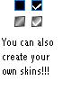



## ActiveX Checkbox V1

### Description

An ActiveX checkbox, you can use the default skin or create images (in paint) and use them as checkbox skins by code!
 
### More Info
 

             |
---                |---
**Submitted On**   |2004-07-20 14:15:26
**By**             |[HardStream](https://github.com/Planet-Source-Code/PSCIndex/blob/master/ByAuthor/hardstream.md)
**Level**          |Beginner
**User Rating**    |4.2 (25 globes from 6 users)
**Compatibility**  |VB 4\.0 \(32\-bit\), VB 5\.0, VB 6\.0
**Category**       |[OLE/ COM/ DCOM/ Active\-X](https://github.com/Planet-Source-Code/PSCIndex/blob/master/ByCategory/ole-com-dcom-active-x__1-29.md)
**World**          |[Visual Basic](https://github.com/Planet-Source-Code/PSCIndex/blob/master/ByWorld/visual-basic.md)
**Archive File**   |[ActiveX\_Ch1772027202004\.zip](https://github.com/Planet-Source-Code/hardstream-activex-checkbox-v1__1-55057/archive/master.zip)

